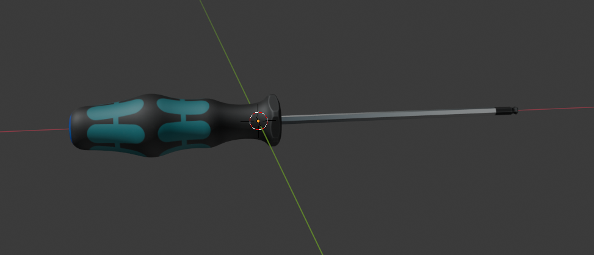
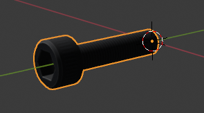
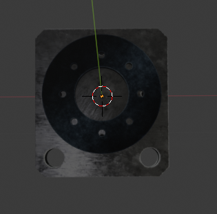
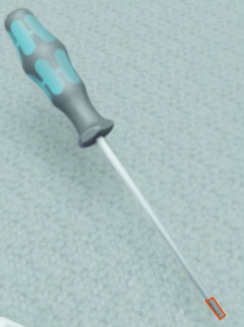
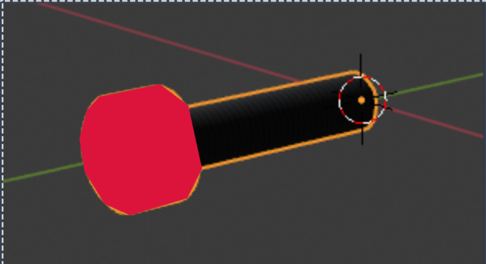
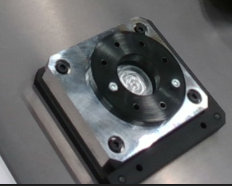
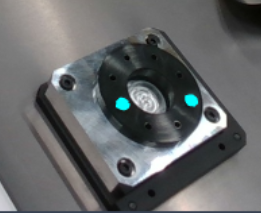

## Instructions for annotating the data

### Positive Classes
The following classes are considered as positive classes:
1. Screw Driver
   A sample image of screw driver is shown below:    
   

   Annotation id: 1

2. Screw
   A sample image of screw is shown below:     
    

    Annotation id: 2

3. Work-piece
   A sample image of work-piece is shown below:     
    

    Annotation id: 3

### Second level of annotation

Apart from the above classes, the following classes are also considered as positive classes:

However, annotate these classes only if they are clearly visible in the image. If the object is not clearly visible, then do not annotate it. Do separate the images which have images which have these classes in separate folders if possible.

1. Tip of screw driver
   As shown in the image below:      
    

    Annotation id: 4

2. Head of screw
   As shown in the image below:     
    

    Annotation id: 5

3. Screws inside the work-piece
   As shown in the image below:         
    Original image           
    

    Segmented image           
    

    Annotation id: 6

### Final Annonation
One sample image of final annotation is shown below:          

### Negative Classes
Apart from the above classes all the other classes are considered as negative classes.

## Additional Note

In images like the below one, the screw in the stand should be annotated similar to the ones lying around on the table

